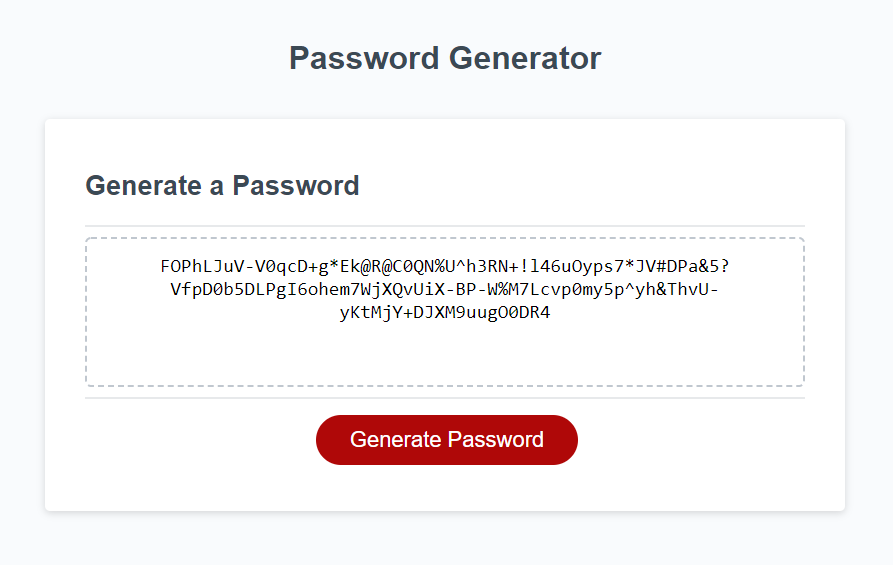

# Sweet-New-Password
## Random password generator
Generates a random password based off given criteria.

### What was your motivation?
- Web development careers dont rely on just a cover letter and resume. Employers need to see skills showcased.

### Why did you build this project?
- I built this project to help me make strong a secure passwords!

### What problem does it solve?
- No more getting a weak or normal strengh password, or difficulty with coming up with a password.

### What did you learn?
- This project was a tough one. I learned a lot about functions, variables, loops, and how math is used in JavaScript.

## Sample Website
[DEMO LINK](https://bdubz93.github.io/Sweet-New-Password/) 
## Installation
- Click the green code button on GitHub
- Select clone, GitHub Desktop, or download ZIP
- Open downloaded folder and open index.html
## Usage
- Generates a random password based off given criteria

## Credits
- https://dev.to/code_mystery/random-password-generator-using-javascript-6a
- https://www.youtube.com/watch?v=duNmhKgtcsI
- https://www.w3schools.com/js/js_arithmetic.asp
- https://www.w3schools.com/jsref/jsref_obj_array.asp
- https://www.w3schools.com/js/js_loop_while.asp
- https://developer.mozilla.org/en-US/docs/Web/JavaScript/Reference/Global_Objects/Math/random
## License
- [APACHE 2.0 LICENSE](license)
---
